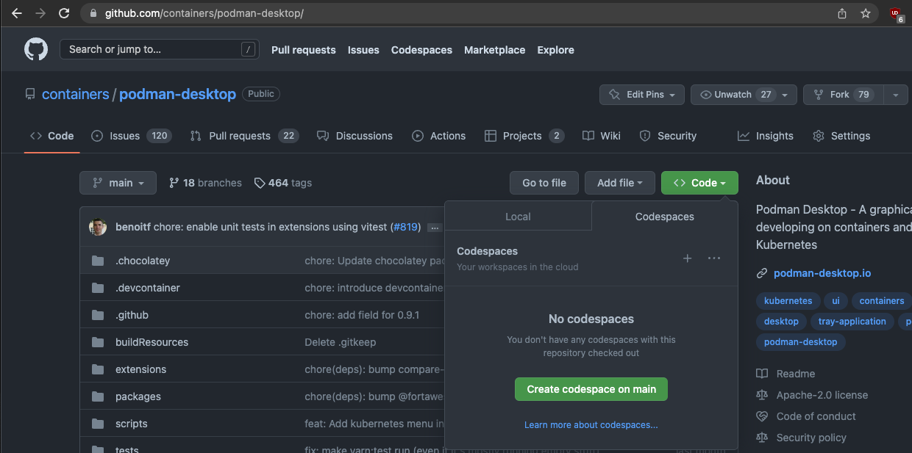
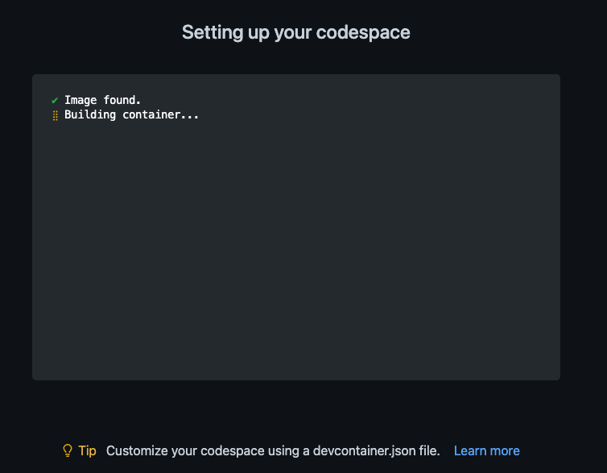
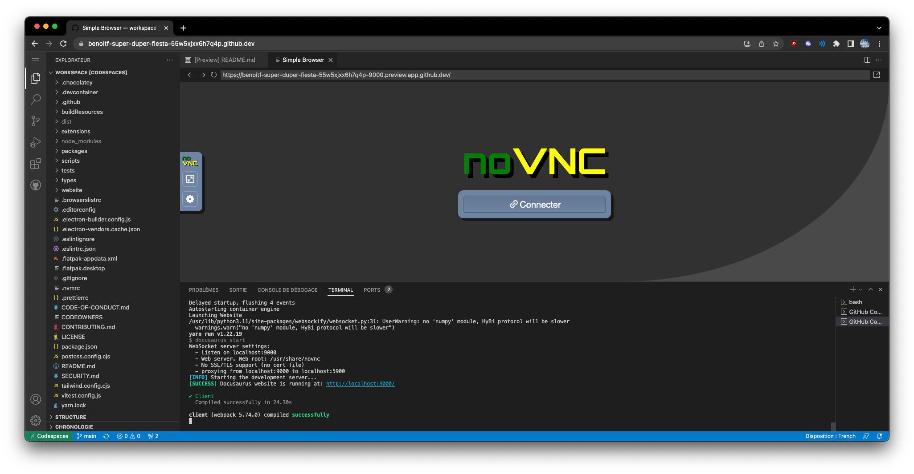
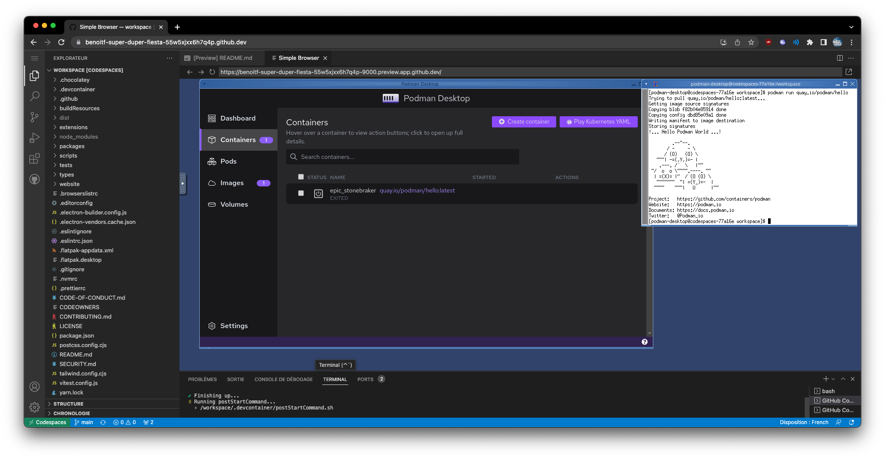
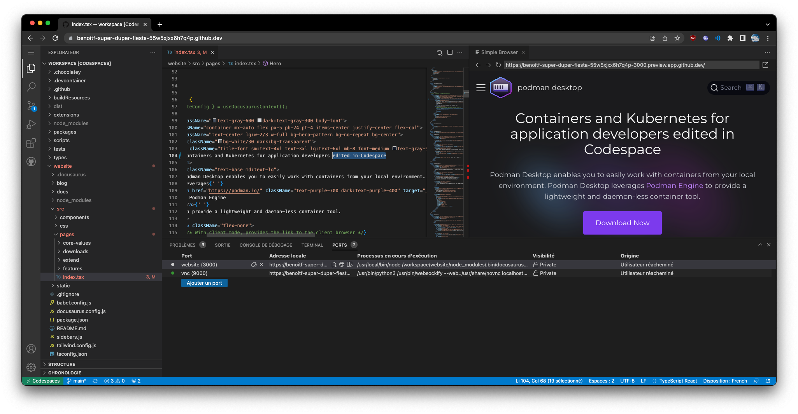

GitHub [announced last week](https://github.blog/changelog/2022-11-09-codespaces-for-free-and-pro-accounts/) that Codespaces is available for everyone and it includes free minutes.

Let see how we can use a [Development Container](https://containers.dev/) having all the tools to build and run Podman Desktop. The Development Container works locally using Visual Studio Code but in this blog post we will see how it works directly with a simple click from GitHub.

The challenges are to run a desktop tool (Podman Desktop) and running a container engine (Podman) inside this Development Container without using too many memory !

<!--truncate-->

## Defining image of the container

The first thing is in the choice of the image for the container. It is possible to pick-up a default image and add some features but there is no existing feature for Podman at https://github.com/devcontainers/features/tree/main/src and most of the features are expecting to run on top of Debian/Ubuntu

If you are not interested in how to setup the image, jump to the [next section](#configure-the-devcontainer-using-devcontainerjson).

Podman binaries are available quickly after the releases for Fedora. I decided then to use `Fedora 37` as the base image.

Let start the Containerfile using:

```docker
FROM quay.io/fedora/fedora:37
```

Then I install Node.js 16 from official nodejs.org repository. It's easier to switch to the version that we need.

```docker
# install Node.js + yarn
ENV NODE_VERSION 16.18.1
RUN curl -SLO "https://nodejs.org/dist/v$NODE_VERSION/node-v$NODE_VERSION-linux-x64.tar.gz" && \
    tar -xzf "node-v$NODE_VERSION-linux-x64.tar.gz" -C /usr/local --strip-components=1 && \
    rm "node-v$NODE_VERSION-linux-x64.tar.gz" && \
    npm install -g yarn
```

Now, all system dependencies used to run an Electron application needs to be installed.

Podman is also installed so we can run some containers inside this container.

And of course, we need to install VNC (I choose [tigervnc](https://tigervnc.org/)) with a light Window Manager ([fluxbox](http://fluxbox.org/)).

To connect to the display of the container, we need to expose VNC over HTML/websocket using [noVNC](https://novnc.com/)

xterm is installed to start a terminal from the VNC side.

```docker
RUN dnf -y update && \
    yum -y reinstall shadow-utils && \
    yum install -y git \
                   # dependencies for Podman Desktop
                   nss \
                   atk \
                   at-spi2-atk \
                   cups-libs \
                   gtk3 \
                   # for remote Display
                   fluxbox \
                   tigervnc-server \
                   xorg-x11-fonts-Type1 \
                   novnc \
                   supervisor \
                   xdpyinfo \
                   # for podman
                   podman \
                   fuse-overlayfs --exclude container-selinux \
                   xterm && \
    rm -rf /var/cache /var/log/dnf* /var/log/yum.*
```

Supervisord setup the launch of the VNC server and the Window manager

```docker
COPY supervisord.conf /etc/supervisord.conf
```

A custom theme for fluxbox:

```docker
COPY fluxbox /usr/share/fluxbox/init
```

Then we need a special configuration to allow to have Podman working inside the container

We add the `podman-desktop` user with correct range on subuid and subgid when running containers. I used the [tutorial](https://github.com/containers/podman/blob/main/docs/tutorials/rootless_tutorial.md#etcsubuid-and-etcsubgid-configuration).

```docker
RUN useradd -u 1000 podman-desktop && echo podman-desktop:10000:5000 > /etc/subuid && echo podman-desktop:10000:5000 > /etc/subgid
```

Then use some default configuration files

```docker
# initialize conf files
ADD https://raw.githubusercontent.com/containers/libpod/master/contrib/podmanimage/stable/containers.conf /etc/containers/containers.conf
ADD https://raw.githubusercontent.com/containers/libpod/master/contrib/podmanimage/stable/podman-containers.conf /home/podman-desktop/.config/containers/containers.conf
```

and make sure that all permissions are correct following the guide [https://www.redhat.com/sysadmin/podman-inside-container](https://www.redhat.com/sysadmin/podman-inside-container)

```docker
# set permissions
RUN chown podman-desktop:podman-desktop -R /home/podman-desktop && chmod 644 /etc/containers/containers.conf && \
    mkdir -p /var/lib/shared/overlay-images /var/lib/shared/overlay-layers /var/lib/shared/vfs-images /var/lib/shared/vfs-layers; touch /var/lib/shared/overlay-images/images.lock; touch /var/lib/shared/overlay-layers/layers.lock; touch /var/lib/shared/vfs-images/images.lock; touch /var/lib/shared/vfs-layers/layers.lock && \
    mkdir -p /run/user/1000 && chown podman-desktop:podman-desktop /run/user/1000
```

plus define an empty user namespace.

```docker
ENV _CONTAINERS_USERNS_CONFIGURED=""
```

Make sure Podman will create the socket in an expected directory:

```
# socket path for podman
ENV XDG_RUNTIME_DIR=/run/user/1000
```

OK ! we have a custom Containerfile providing all the tools to build and run Podman Desktop (using VNC for the display), run Podman and run Electron.

The current file is available at https://github.com/containers/podman-desktop/blob/main/.devcontainer/.parent/Containerfile

Let's configure the DevContainer.

## Configure the DevContainer using devcontainer.json

DevContainer definition is stored at `.devcontainer/devcontainer.json` file.

We need to reuse the image of the previous step. For that let's use the build section of the `devcontainer.json` file.

```json
"build": {
  "dockerfile": "Containerfile"
},
```

In order to avoid to redo all the build steps each time we open a workspace using this dev container, we published the image to quay.io at [quay.io/podman-desktop/devcontainer-parent:next
](https://quay.io/repository/podman-desktop/devcontainer-parent?tab=tags&tag=next). This parent image is not changing much so it's better to use is as a parent one.

Inside `.devcontainer` directory there is a `.parent` directory with everything related to the parent image.

And in the `.devcontainer/Containerfile` file we reference this image

```docker
FROM quay.io/podman-desktop/devcontainer-parent:next
```

By default, we will be `root` in the container and this is probably not what we expect. Let's change that.

```json
"containerUser": "podman-desktop"
```

Some Visual Studio Code extensions are nice to use and we can add them

```json
  "extensions": ["svelte.svelte-vscode", "bradlc.vscode-tailwindcss"]
```

Then here is the tricky part, how to run our container allowing to run again inside the container some containers with podman.

We specify the arguments to make it possible. It's possible to use `--privileged` flag but I prefer to list the subset of permissions.
Using `--privileged` we don't really know what are the privilege that are required while specifying all of them, people are aware of what is granted/denied.

```json
"runArgs": [
    "--cap-add=sys_admin",
    "--security-opt",
    "seccomp=unconfined",
    "--device",
    "/dev/fuse",
    "--security-opt",
    "label=disable",
    "--security-opt",
    "apparmor=unconfined"
  ],
```

Source code of Podman Desktop needs to be editable within the DevContainer so it needs to be mounted.

```json
"workspaceMount": "source=${localWorkspaceFolder},target=/workspace,type=bind",
"workspaceFolder": "/workspace",
```

Then we need a command to build Podman Desktop.

For that, we use `onCreateCommand` hook with a custom command

```json
"onCreateCommand": "${containerWorkspaceFolder}/.devcontainer/onCreateCommand.sh",
```

and in the `.devcontainer` folder the `onCreateCommand.sh` script is the following

```shell
#!/bin/sh
yarn

MODE=production yarn run build && yarn run electron-builder build --linux --dir --config .electron-builder.config.cjs
```

Two instructions:

1. Fetch all Node.js dependencies.
2. build Podman Desktop in the `dist` folder using `Linux` as target Operating System.

After the start of the container, how to launch Podman Desktop, the website and VNC, etc ?

Just use `postStartCommand` hook.

```json
"postStartCommand": "${containerWorkspaceFolder}/.devcontainer/postStartCommand.sh",
```

and in the `.devcontainer` folder the `postStartCommand.sh` script is the following:

```shell
#!/bin/sh

# Start all services
/usr/bin/supervisord -c /etc/supervisord.conf &

# wait X server to be ready or after 2mn exit
echo "Waiting for X server to be ready"
timeout 120 bash -c 'until xdpyinfo -display :0 &> /dev/null; do printf "."; sleep 1; done'

# launch podman desktop
echo "Launching Podman Desktop"
cd dist/linux-unpacked/&& ./podman-desktop &

# Launch the 9000 redirect after 20 seconds
sleep 20
websockify --web=/usr/share/novnc localhost:9000 localhost:5900 &

# launch the website rendering
echo "Launching Website"
cd website && yarn start
```

It starts VNC and noVNC, start precompiled Podman Desktop and start the documentation rendering.

It is not launching the Watch mode/development mode of Podman Desktop as it requires a container having more than 8GB of memory.

Picking up a larger instace with for example 16GB, it's possible to use development mode.

Of course, to make VNC happy, we need to specify the `DISPLAY` environment variable.

```json
"remoteEnv": {
  "DISPLAY": ":0"
}
```

When the DevContainer is fully available, we want to have a way to quickly open the `Website rendering URL` and `noVNC`

Let's tweak the `devcontainer.json` file by adding the `portsAttributes` section

```json
"portsAttributes": {
  "9000": {
    "label": "vnc",
    "onAutoForward": "openPreview"
  },
  "3000": {
    "label": "website"
  }
}
```

After all post-creation steps, the `Preview` browser inside the VS Code editor will open a window to VNC. And another port (`3000`) is flagged for the website.

## Using the DevContainer.json on Github Codespace

As a user, opening a workspace with all what we configured is done using a single click.

Go to https://github.com/containers/podman-desktop then click on the `< > Code` dropdown and click on `Create codespace on main` button.



Once you click on the button, the codespace is setting up:



After few minutes, as there is not yet [prebuilt codespaces](https://docs.github.com/en/codespaces/prebuilding-your-codespaces/about-github-codespaces-prebuilds), the codespace is opening.

The simple Browser displays the noVNC window:


Click on the connect button. Then on the terminal you can enter `podman run quay.io/podman/hello` and the container is detected in Podman Desktop.


It's also possible using the port widget to get on `3000` port by clicking on the world icon a preview of the website in another tab. Changing source code of the website will refresh the content of the window.

Depending on the usecase, it's also possible to open documentation in the preview browser.



## Conclusion

The DevContainer image for Podman Desktop is recent so it'll probably evolve over time by adding new capabilities but it allows you to easily build/run/experiment and **contribute** to the tool or the website.
