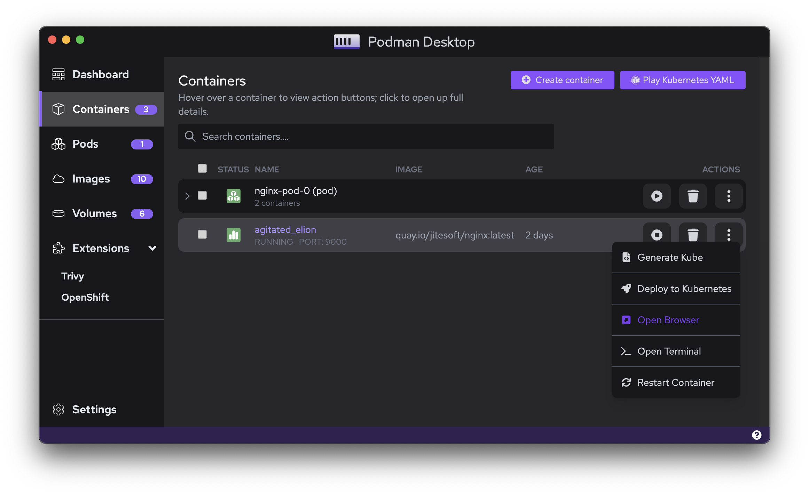

Let's talk about all that is new with the latest release of Podman Desktop v0.10.0!

<!--truncate-->

## Improved Kubernetes Workflow
Podman Desktop facilitates the application development process right from containerization to Kubernetes deployment. With a focus on improving the Kubernetes workflow, we’ve introduced a set of new features.

**1. Custom Kubeconfig file path ([#780](https://github.com/containers/podman-desktop/pull/780))** 

Starting v0.10.0, users can provide their kubeconfig path location instead of letting Podman Desktop use the default path i.e. `$HOME/.kube/config`. This can be done by going to `Settings > Preferences > Kubernetes: Kubeconfig`

**2. Play Kubernetes YAML from the Containers list ([#739](https://github.com/containers/podman-desktop/pull/739))**

Development workflows can require developers to leverage existing Kubernetes YAML files. Podman Desktop now supports playing Pods or Containers from an existing Kubernetes YAML File. 

This can be done in the ‘Containers’ screen of the application by clicking the `Play Kubernetes YAML` button and playing the existing YAML file.

**3. Kube context automatically reloaded when updated ([#813](https://github.com/containers/podman-desktop/pull/813))**

Previously, Podman Desktop captured the kube context only at startup. Any change to the kube context would not be detected after that. This required the user to restart Podman Desktop. With this change, one can now reload kube context without restarting Podman Desktop.

Launch Podman Desktop and then try to change the current kube context either by using the tray icon or with `kubectl` tool and then try to use ‘Deploy to Kubernetes’ feature, the selected context should be displayed.

## UI Improvements

**1. Kebab menu ([#877](https://github.com/containers/podman-desktop/pull/877))**

With the latest release, you will see significant changes with respect to the options and how they are displayed for images and containers. Previously, there was an array of buttons over each container or image component which has now been replaced with a ‘kebab’ menu. This is more user-friendly and keeps all options organized within a single component. By clicking the three dot button, you can open the menu and choose the option depending on your workflow.

**2. Containers ([#878](https://github.com/containers/podman-desktop/pull/878))**

The list of containers now also displays the age of the container as well as the image used to start the container in separate columns alongside the container name.

**3. Responsive Design ([#771](https://github.com/containers/podman-desktop/pull/771), [#774](https://github.com/containers/podman-desktop/pull/774))**

On account of the effort to improve the User Experience, we have made the UI more responsive to window size changes. This includes animations as well as consistent design across all sections of the application.

**4. Registries ([#747](https://github.com/containers/podman-desktop/pull/747))**

We have also updated the UI of the page where we add/update registries in ‘Settings’.

**5. Font and text ([#802](https://github.com/containers/podman-desktop/pull/802), [#904](https://github.com/containers/podman-desktop/pull/904))**

Other improvements include making font colors across the application consistent. Significant efforts have been made to display information correctly whether they are container logs or other text information.

## Major enhancements and fixes

**1. More options to configure containers ([#773](https://github.com/containers/podman-desktop/pull/773))**

Until now, we could only specify port binding when building images to start containers. With the latest release, it includes several options such as configuring volumes, environment variables, some more advanced options including restart policy and options regarding networking and security. You can also reuse a network when creating containers.

**2. Notify Proxy Changes ([#875](https://github.com/containers/podman-desktop/pull/875))**

Updates to the proxy are now propagated to the listeners.

**3. Automate the creation of the Podman Socket when installing from Flatpack ([#860](https://github.com/containers/podman-desktop/pull/860))**

On Linux, installing Podman Desktop with flatpak will detect if the Podman socket exists or not and create it if necessary. That fixes an issue where Podman Desktop was starting but not detecting Podman properly.

**4. Improving consistency of default machine nomenclature ([#775](https://github.com/containers/podman-desktop/pull/775))**

In order to maintain the consistency with Podman machines initialized from CLI, the default name for Podman machine initialized from the `Resources` page of Podman Desktop is now `podman-machine-default`.

**5. Fixed error handling when pulling images for Desktop Extensions ([#782](https://github.com/containers/podman-desktop/pull/782))**

If Podman Desktop faces an error while pulling images for Desktop Extensions, the process is terminated and the error is communicated to the user.

**6. Responsive machine addition or deletion ([#831](https://github.com/containers/podman-desktop/pull/831))**

When Podman Machine is initialized or deleted, the real-time status is reflected on the menu to the side.

**7. Validate domains for registries ([#838](https://github.com/containers/podman-desktop/pull/838))**

The process to validate registry domains when they are added to Podman Desktop has been improved with the validator library.

**8. Input handling ([#721](https://github.com/containers/podman-desktop/pull/721))**

Whitespaces in the input for image names are now identified and handled.

<!-- ## Website and documentation

**1. New Website UI**

As part of our continued efforts to improve the application development journey, we have a new UI for our website which acts as a one-stop-shop for all the information regarding Podman Desktop

**2. Documentation and communication channels**

As more improvements are made, information with respect to Podman Desktop will be made available in the Documentation section of the website. The website now also has information on various channels where we engage with the community. You can find these on the footer of the website. -->

## Closing Notes

Get the latest release from the [Downloads](/downloads) section of the website and boost your development journey with Podman Desktop. Additionally, visit the [GitHub repository](https://github.com/containers/podman-desktop) and see how you can help us make Podman Desktop better. 
