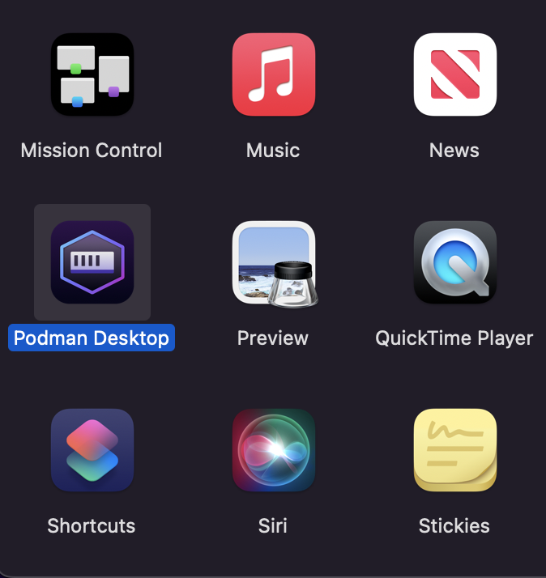

# MacOS

This page contains information regarding installation of Podman Desktop on MacOS. There are two ways by which this is possible; both of which are discussed below.

## Installing Podman Desktop on MacOS using .dmg file

### 1. Download the file

+ • In order to install Podman Desktop and start running containers, you can download the .dmg file from the [Downloads](/downloads/macos) section of this website.
+ • While we recommend getting the "universal" binary file which will work irrespective of the chip architecture your Mac possesses, you also have the option to get the applicable .dmg file depending on your Mac Hardware Architecture (i.e. Intel or Apple M1).

### 2. Install Podman Desktop

- • Once you have downloaded the file of your choice, you can find it in the Downloads folder. Double-click the file to open it in your device.

> 

- • Once you open it, the system will prompt you to drag the icon to the Applications folder.

> 

- • After which, you are just a click away from using Podman Desktop. You can find Podman Desktop either on the 'Launchpad' or Mac's 'Applications' directory.

- • Double-click the icon to open Podman Desktop.

> 

### 3. Check for Prerequisites

- • When you open Podman Desktop for the first time, click on the "View detection checks" button to see if all the prerequisites to use Podman Desktop are met. 
- • If it says `❌ podman cli was not found in the PATH`, then you need to install the Podman CLI/Engine which can be done within the application. You can read more about Podman Engine [here](https://docs.podman.io/en/latest/).


### 4. Install Podman CLI/Engine

- • In order to get Podman CLI/Engine, you can click on the "Install" button next to the "View detection checks" button, and follow the instructions on screen. 
- • You will be redirected to the Podman Installer. Follow the instructions on screen and enter your system password when asked.


After installation is complete, close the Installer and you are all set to build images and run containers using Podman Desktop. Learn more on how to get started with Podman Desktop by clicking [here](/docs/getting-started/getting-started).

## Installing Podman Desktop on MacOS using [brew](https://brew.sh/).

The following command will help you install Podman Desktop on your Mac through [Homebrew](https://brew.sh/). So make sure you have that installed and set up. 

To install Podman Desktop, simply run the command below:

```sh
brew install podman-desktop
```

After the command is executed, you can find the Podman Desktop Application within the Applications directory of the MacOS. Brew will also install the Podman CLI/Engine along with the Podman Desktop application. In this case, you thus need not worry about any dependency.
