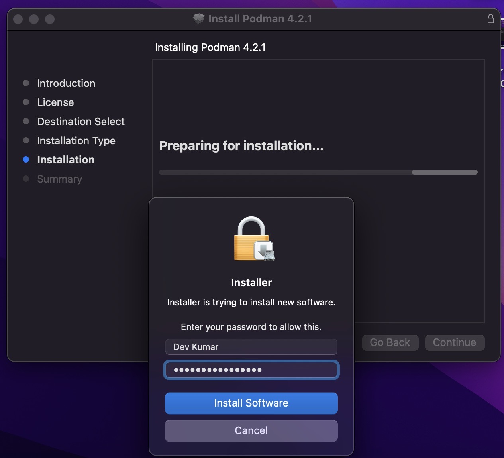

# MacOS
## Installing Podman Desktop on MacOS using .dmg file

#### Prerequisite: Podman Machine

If you already have a Podman machine up and running, you can check out the [Downloads](/downloads/macos) section of this website to get the applicable .dmg file depending on your Mac Hardware Architecture (i.e. Intel or Apple M1).

If you are new to Podman and do not have a Podman Machine up and running, fret not. Downloading and Installing Podman Desktop allows you to get all the dependencies as well.

Simply download the file from the [Downloads](/downloads/macos) section and open it in your machine to install Podman Desktop.

Once you open it, the system will prompt you to drag the icon to the Applications folder.


After which, you are just a click away from using Podman Desktop.

If you already have Podman installed, you are ready to build images and run containers. Learn more on how to get started with Podman Desktop by clicking [here](/docs/getting-started/getting-started).

If the system does not have Podman installed, you will be prompted as follows.


You can click on the "Install" button and follow the instructions on screen. You will be redirected to the Podman Installer. Follow the instructions on screen and enter your system password when asked.



After installation is complete, close the Installer and you are all set to build images and run containers using Podman Desktop.

## Installing Podman Desktop on MacOS using [brew](https://brew.sh/).

The following instructions will help you install Podman Desktop on your Mac through [Homebrew](https://brew.sh/). So make sure you have that installed and set up. After which, you can install Podman Desktop in 3 simple steps.

### 1. Install Podman Container Engine

```sh
brew install podman 
```
In case you have Podman already installed, make sure it is up-to-date. 

### 2. Initialize & Start the Podman Machine

On Mac, each Podman machine is backed by a [QEMU](https://qemu.org)-based virtual machine. All the tasks related to Podman are executed within this Virtual Machine (VM) as they remotely communicate with the podman service running in the VM.

To initialize the machine, the command is

```sh
podman machine init
```

After which, you can start the machine with the command

```sh
podman machine start
```

### 3. Install Podman Desktop Application for MacOS

After the Podman Machine is initialized and started, you can work with it using the Podman Desktop Application. To install the same, simply run the command below:

```sh
brew install podman-desktop
```

After the command is executed, you can find the Podman Desktop Application within the Applications directory of the MacOS.

