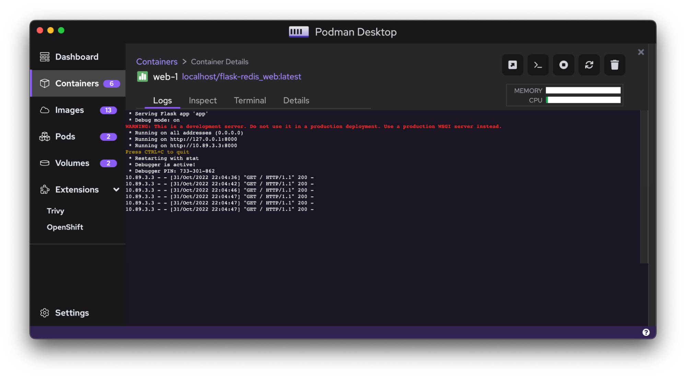

## Introduction

Podman Desktop is aimed at providing the Podman experience to the developers with a Graphical User Interface. Many developers who enjoy using Podman Engine to work with containers are also avid users of Podman Compose. 

[Podman Compose](https://github.com/containers/podman-compose#readme) is a community-driven tool that allows developers to run multiple containers at the same time and facilitate communication between them. Much like Docker Compose, it requires a Compose YAML file with definitions about the containers that need to communicate.

If you are new to writing [Compose files](https://github.com/compose-spec/compose-spec/blob/master/spec.md#compose-file) or [Compose Spec](https://compose-spec.io/), check [this guide](https://github.com/compose-spec/compose-spec/blob/master/spec.md) for more information. 

## Requirements

### 1. Podman Desktop
Get the latest version of Podman Desktop by clicking [here](/downloads). Refer to the [installation guide](/docs/installation) for more instructions.
### 2. Podman Compose
Read along for more information on how to install Podman Compose.

## Get Started

In this tutorial, we will learn about working with containers on Podman Desktop generated using podman-compose. You can find more information about Podman Compose [here](https://github.com/containers/podman-compose/blob/devel/README.md). 

### 1. Install podman-compose
#### For MacOS

There are many ways to install podman-compose on your MacOS system. One of the easier ways is to use Homebrew. To install podman-compose, simply run the following command

```sh
brew install podman-compose
```

To ensure podman-compose is properly installed, run the command 
```sh
podman-compose
``` 
and it will return more information about the same.

#### For Windows and Linux

Refer this official [installation guide](https://github.com/containers/podman-compose#installation) to get the latest version of Podman Compose on your Windows or Linux system. 

### 2. Using Podman Compose to run multiple containers

For this tutorial, I will use the [flask-redis project](https://github.com/docker/awesome-compose/tree/master/flask-redis) from the [awesome-compose repository](https://github.com/docker/awesome-compose). This repository consists of many sample projects for you to get started with Podman Compose. 
1. Open the Terminal
2. Go inside the project directory with the command 
```sh
cd flask-redis
```
3. Run the following command 
```sh
podman-compose -f compose.yaml up -d
```
The `compose.yaml` file contains definitions for multiple containers within the `flask-redis` project. If you are new to this, read more about Compose files [here](https://github.com/compose-spec/compose-spec/blob/master/spec.md#compose-file).


### 3. Manage these containers with Podman Desktop

In order to check if the containers are running as expected, open Podman Desktop and click on the ‘Containers’ option on the left side of the application. You will notice that the containers are bundled together under a Pod named `flask-redis (compose)` in this case. Here, the compose within the bracket indicates that it is generated from a compose YAML file. 


You can further configure or work with these containers within the Podman Desktop application now that they are visible. Here, clicking on the ‘Open Browser’ button allows us to check if the application is running as expected. 


You can do much more such as check Logs for the containers, open the Terminal or Inspect the files for more details.



## Conclusion

That is it. This is how you can use Podman Desktop for your containers generated through podman-compose. It will be really exciting to see you all developers leverage these compatibilities to build exciting applications using Podman Desktop!

