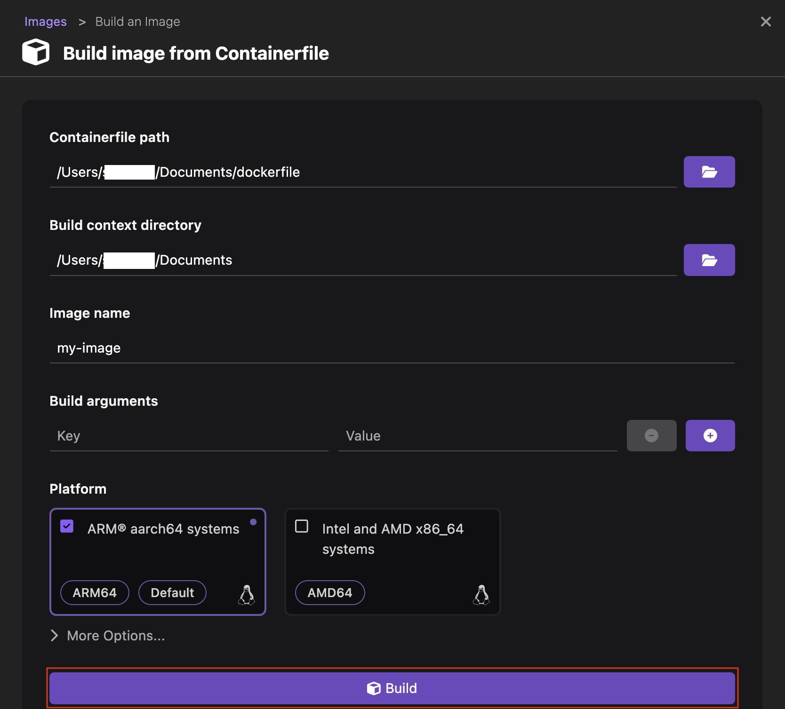
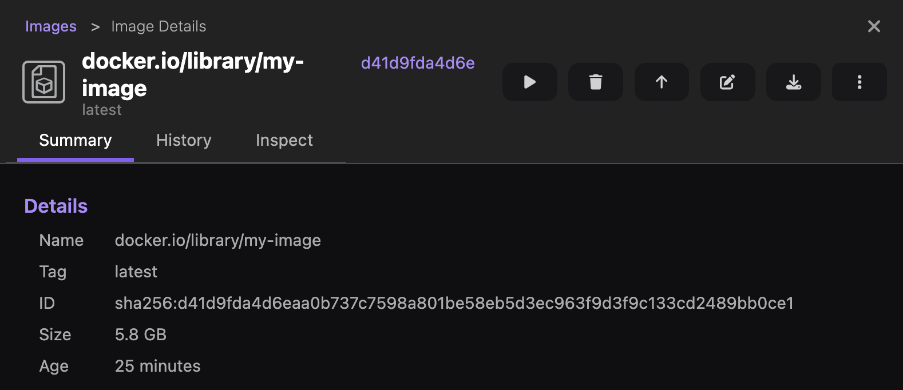

# Building an image on your container engine

With Podman Desktop, you can build an image from a Containerfile on your container engine.

#### Prerequisites

- Your Containerfile: `Containerfile` or `Dockerfile`.

#### Procedure

1. Go to **Images** from the left navigation pane.
1. Click **Build**.
   
1. Provide the following details:
   - **Containerfile path**: Select the `Containerfile` or `Dockerfile` to build.
   - **Build context directory**: The field automatically picks up the context directory based on the file path. You can change the directory, if needed.
   - **Image Name**: Enter your image name, such as `my-image`. If you want to push the image to a registry, use the fully qualified image name that your registry requires, such as `quay.io/my-repository/my-image`, `ghcr.io/my-repository/my-image`, or `docker.io/my-repository/my-image`.
   - **Build arguments**: Pass the key and value for the arguments defined in your `Containerfile` or `Dockerfile`, if needed.
   - **Platform**: Select multiple platforms on which you want to build the image. The default platform is `Intel and AMD x86_64 systems`.
1. Click **Build**.
   
1. Click **Done** after the image is built.

#### Verification

1. View the newly created image on the same page.
   
1. Click the name of the image to view its summary.
   
1. Optional: View the history of the image or inspect the image.
