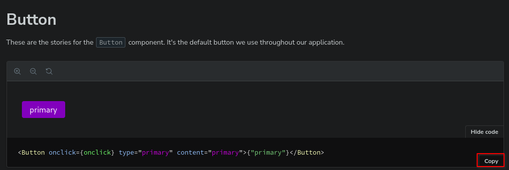

# Adding UI components

You can create your own customized extension and add different UI components to your application front-end page. For example, you can add a new UI component of the type `Button` . If you have your own template, you can use the [ready-to-use code](https://podman-desktop.io/storybook?id=button--docs) to add primary, secondary, loading, or other types of buttons.

:::note

If you do not have hands-on experience and want to explore, use the [minimal, webview, or full template](/docs/extensions/templates) to create a Podman Desktop extension.

:::

#### Procedure

1. Add the `@podman-desktop/ui-svelte` package to your application source code.
1. Open the [storybook link](https://podman-desktop.io/storybook).
1. Go to **Docs** and copy the code for a particular UI component.
   
1. Paste it in your UI source configuration file, such as `UIextension.svelte`.
1. Save the configuration changes.
1. Run your extension and debug it if required.

#### Verification

- Check that the UI component is added in the webview of your extension.
