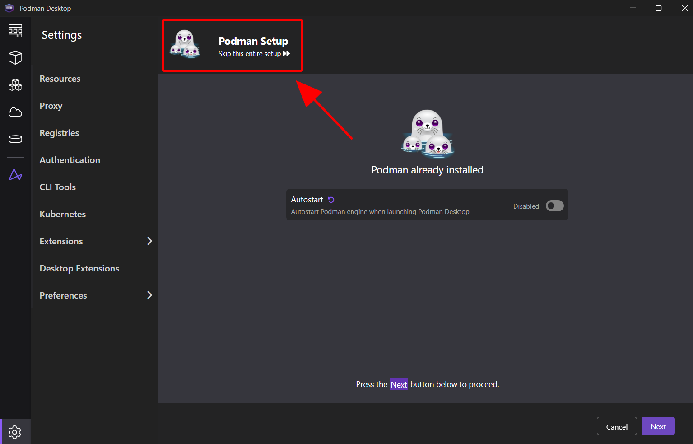
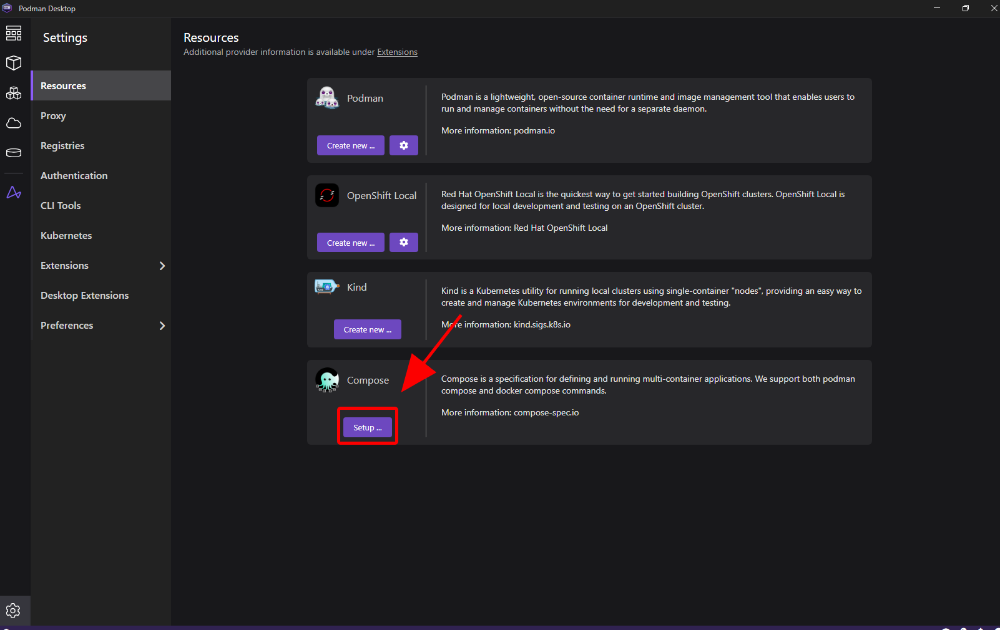
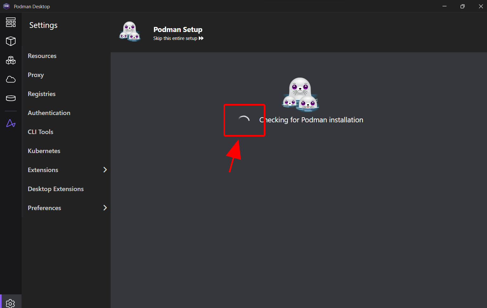
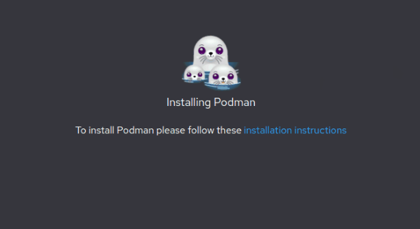
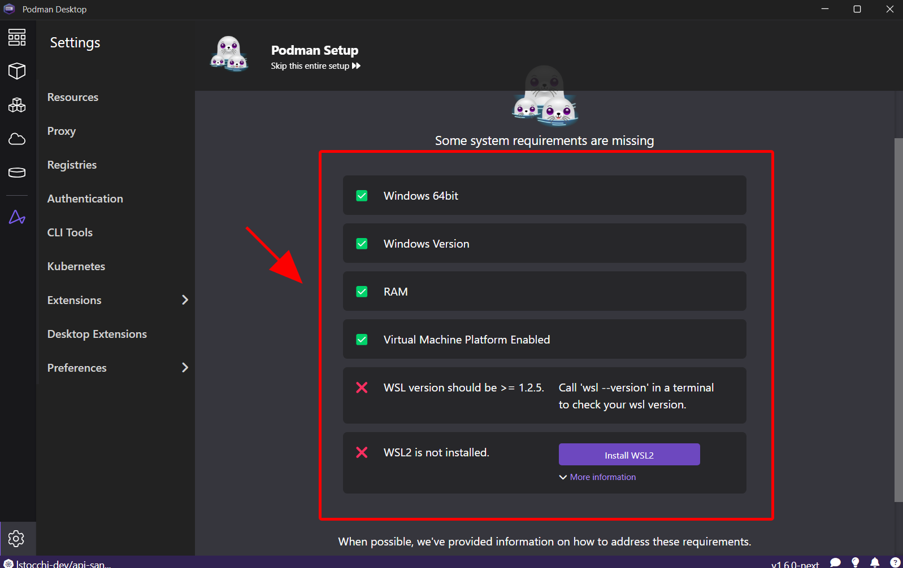

# Onboarding

A Podman Desktop extension can offer an onboarding workflow to guide users in installing and setting up all the necessary tools for the extension to work, and/or to provide explanations about the capabilities of the extension.

Adding onboarding to an extension is as simple as writing a JSON schema in the `package.json`. Podman Desktop will convert the JSON object into actual code to render all items.

Onboarding consists of a title, a description, media (image), an enablement clause, and a list of steps. Before getting into the details, let's examine the JSON schema.

```json
{
  "title": "onboarding",
  "type": "object",
  "properties": {
    "title": {
      "type": "string"
    },
    "description": {
      "type": "string"
    },
    "media": {
      "path": {
        "type": "string"
      },
      "altText": {
        "type": "string"
      }
    },
    "enablement": {
      "type": "string"
    },
    "steps": {
      "type": "array",
      "items": {
        "type": "object",
        "properties": {
          "id": {
            "type": "string"
          },
          "title": {
            "type": "string"
          },
          "description": {
            "type": "string"
          },
          "media": {
            "path": {
              "type": "string"
            },
            "altText": {
              "type": "string"
            }
          },
          "command": {
            "type": "string"
          },
          "completionEvents": {
            "type": "array",
            "items": {
              "type": "string"
            }
          },
          "content": {
            "type": "array",
            "items": {
              "type": "array",
              "items": {
                "type": "object",
                "properties": {
                  "value": {
                    "type": "string"
                  },
                  "highlight": {
                    "type": "boolean"
                  },
                  "when": {
                    "type": "string"
                  }
                },
                "required": ["value"]
              }
            }
          },
          "when": {
            "type": "string"
          },
          "component": {
            "type": "string",
            "enum": ["createContainerProviderConnection", "createKubernetesProviderConnection"]
          },
          "state": {
            "type": "string",
            "enum": ["completed", "failed"]
          }
        },
        "required": ["id", "title"]
      }
    }
  },
  "required": ["title", "enablement", "steps"]
}
```

### Title, Description and Media

The **title**, the **description** and the **media** are all placed in the top left of the onboarding page.
Only the title is required. The description and the media are optional.
If the media is not specified, Podman Desktop will display the default extension icon.

This is how this JSON will be rendered

```json
"icon": "icon.png",
...
"onboarding": {
    "title": "Podman Setup",
}
```



### Enablement

The enablement clause allows Podman Desktop to determine when the onboarding should be enabled.
When this condition is met, the user will find a setup button within the resources page. Clicking on it will initiate the onboarding workflow.



The enablement clause is mandatory and must be written by using [when clauses](when-clause-context.md).

In the following example, we specify that the onboarding needs to be enabled if and only if the user's OS is Linux, and the `podmanIsNotInstalled` context value is true. Alternatively, if the user's OS is different from Linux, that the `podmanMachineExists` context value must be false. In other words, if the user is on Linux, the onboarding must be enabled only if podman is not installed; for all other operating systems, it should be enabled if there is no Podman machine.

```json
"enablement": "(isLinux && onboardingContext:podmanIsNotInstalled) || (!isLinux && !onboardingContext:podmanMachineExists)"
```

### Steps

The steps property is required and includes the actual content that will be displayed to the user during the workflow.

Let's look again at its schema

```json
"type": "object",
"properties": {
    "id": {
        "type": "string"
    },
    "title": {
        "type": "string"
    },
    "description": {
        "type": "string"
    },
    "media": {
        "path": {
            "type": "string"
        },
        "altText": {
            "type": "string"
        },
    },
    "command": {
        "type": "string"
    },
    "completionEvents": {
        "type": "array",
        "items": {
            "type": "string"
        }
    },
    "content": {
        "type": "array",
        "items": {
            "type": "array",
            "items": {
                "type": "object",
                "properties": {
                    "value": {
                        "type": "string"
                    },
                    "highlight": {
                        "type": "boolean"
                    },
                    "when": {
                        "type": "string"
                    }
                },
                "required": ["value"]
            }
        }
    },
    "when": {
        "type": "string"
    },
    "component": {
        "type": "string",
        "enum": ["createContainerProviderConnection", "createKubernetesProviderConnection"]
    },
    "state": {
        "type": "string",
        "enum": ["completed", "failed"]
    }
},
"required": ["id", "title"]
```

A step has only two mandatory fields - id and title. All other properties are optional.

#### Id

The **id** must be unique to identify a step, and it is never displayed directly to the user.

#### Title, description and media

The **title**, **description** and **media** works as explained earlier. The only difference is their placement - they will appear in the top-center of the body.


**Note:** If the media is not specified, Podman Desktop will display the default extension icon.

#### Command

The **command** field allows you to declare the name of a command that must be run when the step becomes active.
The command must be registered by the extension beforehand, or it will result in an error.

In the example below, we tell Podman Desktop to invoke `podman.onboarding.checkPodmanInstalled` when the `checkPodmanInstalled` step becomes active.
Based on the result, we can then prompt the user to move to another step or display a message.

```json
"commands": [
    {
    "command": "podman.onboarding.checkPodmanInstalled",
    "title": "Podman: Check podman installation"
    },
],
"onboarding": {
    "title": "Podman Setup",
    "steps": [
    {
        "id": "checkPodmanInstalled",
        "title": "Checking for Podman installation",
        "command": "podman.onboarding.checkPodmanInstalled",
    },
    ...
    ],
    ...
}
```

During the execution of the command, the user will see a spinner next to the title.



#### CompletionEvents

CompletionEvents define the conditions under which a step should be considered complete.

It currently supports `onboardingContext` and `onCommand` events.
The former can be used to evaluate a context value, such as `onboardingContext:podmanIsInstalled`. The latter checks if the command has been executed - `onCommand:podman.onboarding.installPodman`.

A practical example of progressing the user to the next step after the command finishes its execution is

```json
"commands": [
    {
    "command": "podman.onboarding.checkPodmanInstalled",
    "title": "Podman: Check podman installation"
    },
],
"onboarding": {
    "title": "Podman Setup",
    "steps": [
    {
        "id": "checkPodmanInstalled",
        "title": "Checking for Podman installation",
        "command": "podman.onboarding.checkPodmanInstalled",
        "completionEvents": [
            "onCommand:podman.onboarding.checkPodmanInstalled"
        ]
    },
    ...
    ],
    ...
}
```

When the `checkPodmanInstalled` step becomes active, the command `podman.onboarding.checkPodmanInstalled` is invoked. Upon completion of its execution, the step is considered complete, and the user is then moved to the next one.

Here's another example, this time using a context value:

```json
"commands": [
    {
    "command": "podman.onboarding.checkPodmanInstalled",
    "title": "Podman: Check podman installation"
    },
],
"onboarding": {
    "title": "Podman Setup",
    "steps": [
    {
        "id": "checkPodmanInstalled",
        "title": "Checking for Podman installation",
        "command": "podman.onboarding.checkPodmanInstalled",
        "completionEvents": [
            "onboardingContext:podmanVersion == 4.7.2"
        ]
    },
    ...
    ],
    ...
}
```

When the `checkPodmanInstalled` step becomes active, the command `podman.onboarding.checkPodmanInstalled` is invoked. As soon as the context value `podmanVersion` equals `4.7.2`, the step is marked as completed, and the user is moved to the next one.

You might wonder: who or what sets the context value? If you use a custom context value, it should be your extension's job to set it. Following the example above, we could set the context value during the execution of `podman.onboarding.checkPodmanInstalled` like

```
extensionApi.commands.registerCommand(
    'podman.onboarding.checkPodmanInstalled',
    async () => {
      // do something
      ...
      // set podmanVersion context value so we can mark the step as complete
      extensionApi.context.setValue('podmanVersion', '4.7.2', 'onboarding');
    }
)
```

After updating the context, the UI is refreshed, and Podman Desktop moves the user to the new step.

#### Content

The **content** property is an array of arrays where each item in the parent array defines a row, and each item in the child arrays defines a column.

```
content = [
    ["column", "column"], //row
    ["column", "column", "column"], //row
]
```

The JSON schema for a content column entry is

```json
"type": "object",
"properties": {
    "value": {
        "type": "string"
    },
    "highlight": {
        "type": "boolean"
    },
    "when": {
        "type": "string"
    }
},
"required": ["value"]
```

With **value** being the only mandatory field.

**Value** can be a simple string or a Markdown string to render advanced objects.

In addition to all the standard Markdown syntax, Podman Desktop provides 3 custom Markdown components: button, link, and warnings list.

1 - You can create a button that executes a command (syntax - `:button[Name of the button]{command=command.example title="tooltip text"}`) or behaves like a link (syntax - `:button[Name of the button]{href=http://my-link title="tooltip text"}`).

E.g

```json
"value": ":button[Check requirements again]{command=podman.onboarding.checkPodmanRequirements}"
```


2 - Similarly, you can create a link that executes a command (syntax `:link[Name of the command link]{command=command.example title="tooltip text"}`) or behaves like a normal link (syntax - `:link[Name of the command link]{href=http://my-link title="tooltip text"}`)

E.g:

```json
"value": "To install Podman please follow these :link[installation instructions]{href=https://podman.io/docs/installation#installing-on-linux}"
```



3 - The warning component allows displaying a list of items (syntax - `:warnings[[item]]`), where an item consists of

```json
"type": "object",
"properties": {
    "state": {
        "type": "string"
    },
    "description": {
        "type": "string"
    },
    "command": {
        "type": "object",
        "properties": {
            "id": {
            "type": "string"
            },
            "title": {
            "type": "string"
            }
        },
        "required": [
            "id",
            "title"
        ]
    },
    "docDescription": {
        "type": "string"
    },
    "docLinks": {
        "type": "array",
        "items": {
            "type": "object",
            "properties": {
            "title": {
                "type": "string"
            },
            "url": {
                "type": "string"
            },
            "group": {
                "type": "string"
            }
            },
            "required": [
            "title",
            "url",
            "group"
            ]
        }
    },
}
```

Adding a complete list in the `package.json` can be confusing, so a better approach is to use a context value

```json
"value": ":warnings[${onboardingContext:warningsMarkdown}]"
```

at runtime, `${onboardingContext:warningsMarkdown}` is replaced by the actual list filled in the backend

```
const warnings = [];
...
const warning = {
    state: res.successful ? 'successful' : 'failed',
    description: res.description,
    docDescription: res.docLinksDescription,
    docLinks: res.docLinks,
    command: res.fixCommand,
};
warnings.push(warning);

extensionApi.context.setValue('warningsMarkdown', warnings, 'onboarding');
```



The **highlight** and **when** properties are optional. They are used to change the background color or define when the content column should be visible, respectively.

#### Component

Podman Desktop has some built-in components that can fit perfectly into an onboarding workflow, like the `create new connection` wizard.
If you are working on an extension that allows creating a Kubernetes cluster, it would not make sense to recreate a page where the user can add the name, the resources to use, etc. This is when the component field comes in handy.

By specifying the component you want to import, all the elements, styling, and actions are embedded into the step.

Currently, Podman Desktop only supports two types of components for onboarding: `createContainerProviderConnection` and `createKubernetesProviderConnection`.

An example can be seen in the Podman extension, where you can create a Podman machine during the workflow.

```json
{
    "id": "createPodmanMachine",
    "title": "Create a Podman machine",
    "when": "!onboardingContext:podmanMachineExists && !isLinux",
    "completionEvents": [
        "onboardingContext:podmanMachineExists"
    ],
    "component": "createContainerProviderConnection"
},
```


**N.B:** when using the **component** field, you should omit the **content**

#### When

The **when** property defines when a step must be visible. You can use any when clause, and Podman Desktop will evaluate it any time the context changes.

#### State

The **state**, when set, allows Podman Desktop to distinguish a normal step from a special one. It is used to associate a step with a failed state (`failed`) or, alternatively, with a complete state (`completed`).

**N.B:** the last workflow step should have `completed` state.

Based on the **state**, Podman Desktop may show some default objects.

When a step with a failed state is encountered, Podman Desktop displays a `Retry` button, allowing the user to restart the workflow.

```json
{
    "id": "podmanFailedInstallation",
    "title": "Failed installing Podman",
    "when": "onboardingContext:podmanFailedInstallation",
    "state": "failed"
},
{
    "id": "podmanSuccessfullySetup",
    "title": "Podman successfully setup",
    "when": "onboardingContext:podmanIsInstalled",
    "state": "completed"
}
```
