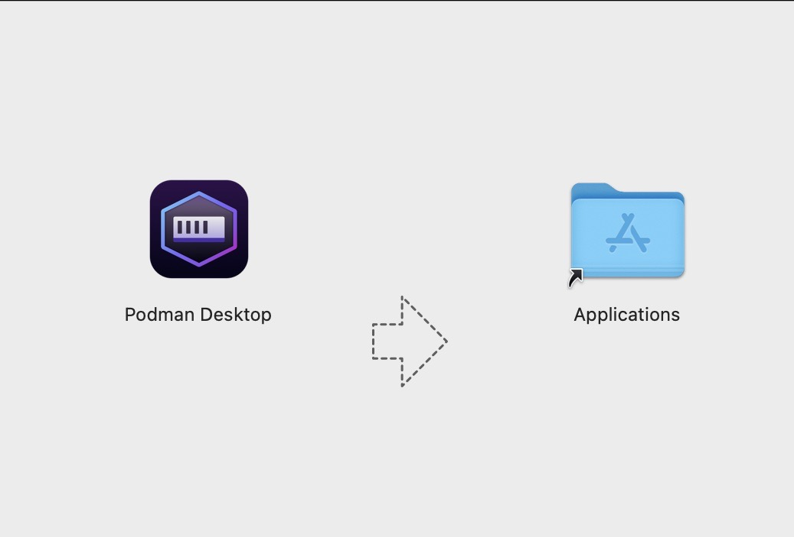

# Installing Podman Desktop

Install Podman Desktop with a `.dmg` file, unless you require [installing with Brew](/docs/installation/macos-install/installing-with-brew).

#### Procedure

1. [Download a Podman Desktop `.dmg` file](/downloads/macos).

   - **Universal**
     - Works on Intel and Apple M1 hardware.
   - **Intel**
   - - Works on Intel hardware.
   - **Arm**
     - Works on Apple M1 hardware.
   - **Disk Image for restricted environments**
     - Works on Intel and Apple M1 hardware.
     - Has all artifacts required to install Podman Desktop and Podman.
     - Does not require Internet access to download resources during installation.
     - Does not contain additional utilities such as Compose or Kind.

2. Locate the downloaded file, and double-click on it.
   Usually, you will find the downloaded file in the Downloads folder.

   

3. Drag Podman Desktop icon to the Applications folder.

   

4. Start Podman Desktop from the 'Launchpad' or Mac's `Applications` directory.

   

#### Next steps

- [Onboarding](/docs/onboarding)
