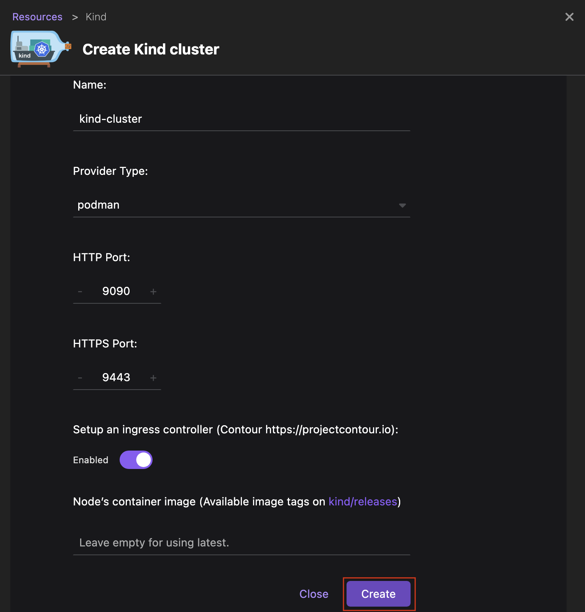

# Creating a local Kind-powered Kubernetes cluster

You can create multiple local Kind-powered Kubernetes clusters.

#### Prerequisites

- [You installed Kind](/docs/kind/installing).
- [On Windows, you configured Podman](/docs/kind/configuring-podman-for-kind-on-windows).

#### Procedure

1. Go to **<Icon icon="fa-solid fa-cog" size="lg" /> Settings > Resources**
1. In the Kind tile, click the **Create new ...** button.
1. Edit the default configuration, if needed.
1. Click the **Create** button.
   
1. Optional: Click the **Show logs** button to view the logs.
1. After successful creation, click the **Go back to resources** button.

#### Verification

1. Go to **<Icon icon="fa-solid fa-cog" size="lg" /> Settings > Resources**, and view your running `<kind-cluster>` instance in the **Kind** tile.
   
1. In the Podman Desktop tray, open the **Kubernetes** menu, you can set the context to your Kind cluster: `kind-<kind-cluster>`.
