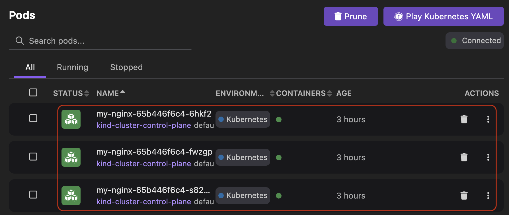

# Applying a YAML manifest

Based on your needs, you can apply a YAML manifest to create a Kubernetes object, such as `Node`, `Deployment`, `Service`, `PersistentVolumeClaim`, and others. For example, a Kubernetes deployment that requires sensitive data storage, you can apply a YAML manifest to create a `Secret` object.

#### Prerequisites

Make sure you have:

- [A running Podman machine](/docs/podman/creating-a-podman-machine).
- [A running Kubernetes cluster](/docs/kind/creating-a-kind-cluster).
- Created a YAML manifest file using the following code, if you do not have one on your machine:

```yaml
apiVersion: apps/v1
kind: Deployment
metadata:
  name: my-nginx
spec:
  selector:
    matchLabels:
      run: my-nginx
  replicas: 3
  template:
    metadata:
      labels:
        run: my-nginx
    spec:
      containers:
        - name: my-nginx
          image: nginx
          ports:
            - containerPort: 80
```
This YAML manifest creates three pods that run the NGINX web server.

#### Procedure: Applying a YAML manifest to create a `Deployment` object

1. Go to the **Kubernetes** component page. 
1. Click **Deployments** in the left navigation pane.
1. Click **Apply YAML** and select the YAML manifest file. A confirmation notification opens.
  
1. Click **OK**.
  


#### Verification

1. View the newly created `my-nginx` deployment on the same page.
  
1. Go to the **Pods** component page to view three instances of the NGINX web server running.
  

    :::note

    When you apply any other YAML manifest, you can view the newly created object on the corresponding component page.

    :::


