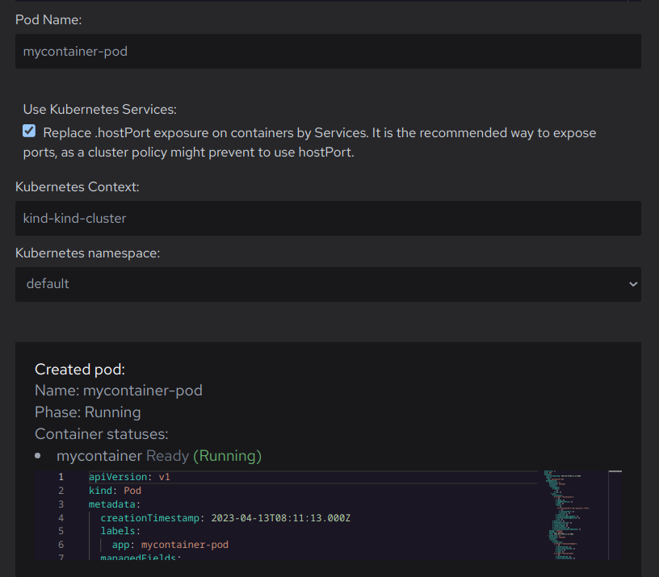

# Deploying a container to Kubernetes

You can deploy a container to Kubernetes with Podman Desktop.

#### Procedure

1. Go to **Containers**.
1. Click on a container name to go to the **Container Details** page.
1. Click the <icon icon="fa-solid fa-rocket" size="lg" /> icon to generate a Kubernetes pod.
1. In the **Deploy generated pod to Kubernetes** screen, choose your options:
   1. Pod Name
   2. Use Kubernetes Services to replace .`hostPort` exposure on containers by Services. It is the recommended way to expose ports, as a cluster policy may prevent to use `hostPort`.
   2. Kubernetes Context
   3. Namespace
1. Click the **<icon icon="fa-solid fa-rocket" size="lg" /> Deploy** button.

#### Verification

* The created pod is running

  
