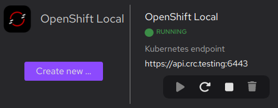

# Creating an OpenShift Local instance

With Podman Desktop, you can manage your OpenShift Local instances.

#### Prerequisites

- [Register a Red Hat account](https://developers.redhat.com/register).

#### Procedure

1. Install the _OpenShift Local_ extension: go to **Dashboard**, and click **OpenShift Local <icon icon="fa-solid fa-download" size="lg" />**.
1. Install the OpenShift Local binaries.
1. Click **Initialize and start**.
1. Select your OpenShift Local Virtual machine preset, if not set in **<icon icon="fa-solid fa-cog" size="lg" /> Settings > Preferences > Extension: Red Hat OpenShift Local > Preset**.
1. Provide a pull secret, required to pull container images from the registry:

   1. Open the [Red Hat OpenShift Local download page](https://cloud.redhat.com/openshift/create/local).
   1. Click **Copy pull secret**.
   1. Get back to Podman Desktop.
   1. Paste the pull secret, and press `Enter`.

#### Verification

1. On the **Dashboard** screen, _OpenShift Local is running_.
1. On the **<icon icon="fa-solid fa-cog" size="lg" />Settings > Resources** screen, your OpenShift Local instance is running.

   

1. [Select your OpenShift Local instance the Podman Desktop tray](../viewing-and-selecting-current-kubernete-context).
1. Run basic tasks such as:
   - [Deploying a container](../deploying-a-container-to-kubernetes)
   - [Deploying a pod](../deploying-a-pod-to-kubernetes)
