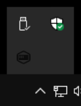
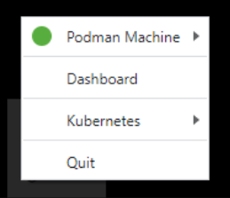
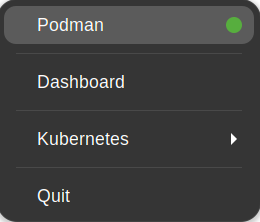
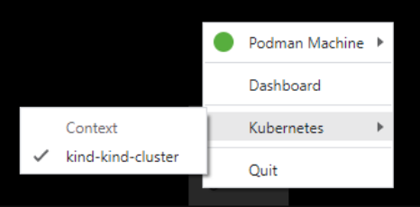
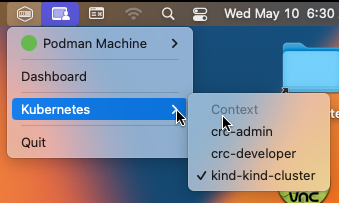

import Tabs from '@theme/Tabs';
import TabItem from '@theme/TabItem';

# Viewing and selecting the current Kubernetes context

With Podman Desktop, you can view and select your current Kubernetes context.

#### Prerequisites

- You have a Kubernetes context in your kubeconfig file: _<your_kubernetes_cluster>_.
  For example, [Creating a kind cluster](kind/creating-a-kind-cluster).

#### Procedure

1. Open the **Podman Desktop tray** menu.

   <Tabs groupId="operating-systems">
   <TabItem value="win" label="Windows">

   In the task bar, click **Show hidden icons**.

   

   Right-click the **Podman Desktop tray** icon to open the menu.

   

   </TabItem>
   <TabItem value="mac" label="macOS">

   

   </TabItem>
   <TabItem value="linux" label="Linux">

   

   </TabItem>

   </Tabs>

1. Click **Kubernetes** to see your current Kubernetes context.

   <Tabs groupId="operating-systems">
   <TabItem value="win" label="Windows">

   

   </TabItem>
   <TabItem value="mac" label="macOS">

   

   </TabItem>
   <TabItem value="linux" label="Linux">

   

   </TabItem>

   </Tabs>

1. (Optionally) To change your Kubernetes context, click on the context name to activate.
