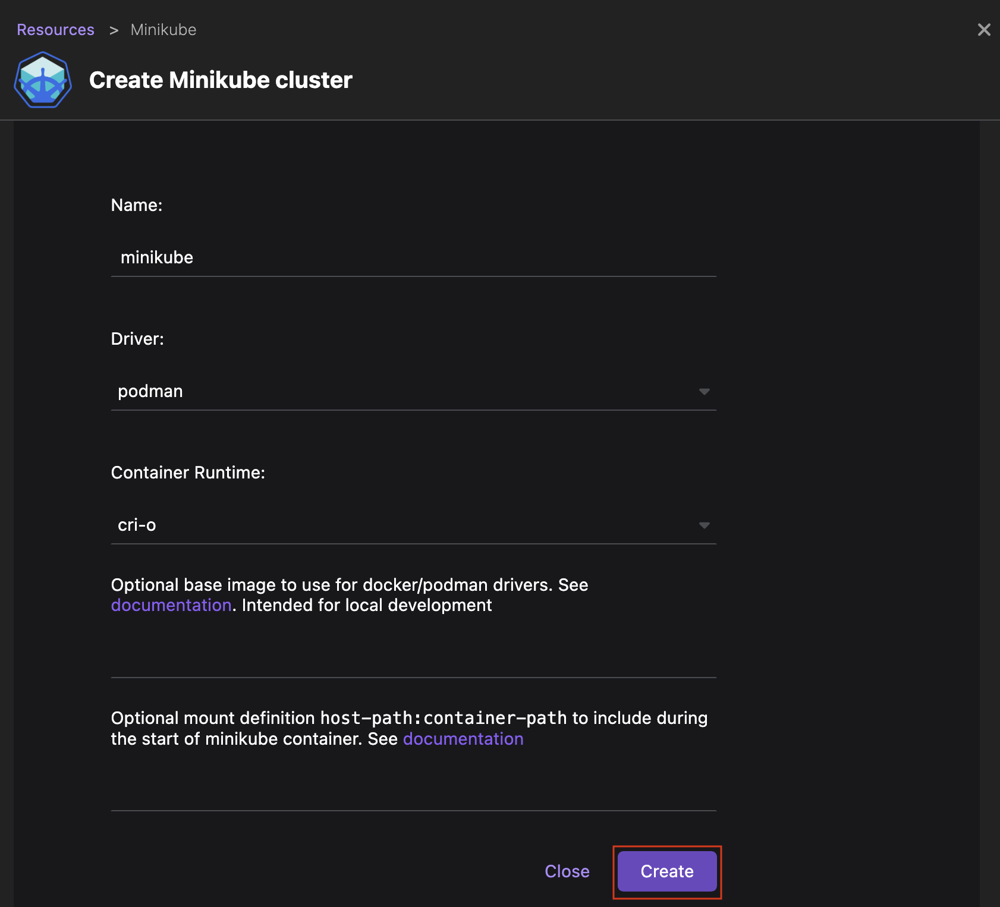
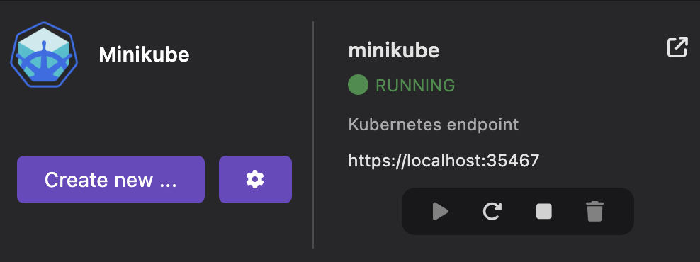

# Creating a local Minikube-powered Kubernetes cluster

You can create multiple local Minikube-powered Kubernetes clusters.

#### Prerequisites

- [You installed Minikube](/docs/minikube/installing).
- [On Windows, you configured Podman](/docs/minikube/configuring-podman-for-minikube-on-windows).

#### Procedure

1. Go to **<Icon icon="fa-solid fa-cog" size="lg" /> Settings > Resources**
1. In the Minikube tile, click the **Create new ...** button.
1. Edit the default configuration, if needed.
1. Click the **Create** button.
   
1. Optional: Click the **Show logs** button to view the logs.
1. After successful creation, click the **Go back to resources** button.

#### Verification

1. Go to **<Icon icon="fa-solid fa-cog" size="lg" /> Settings > Resources**, and view your running `<minikube>` instance in the **Minikube** tile.
   
1. In the Podman Desktop tray, select the **Kubernetes** menu; you can set the context to your Minikube cluster: `minikube`.

   :::note

   Alternatively, use the status bar or the Podman Desktop Settings to set your Kubernetes context. For more details, see [Viewing and selecting the current Kubernetes context](/docs/kubernetes/viewing-and-selecting-current-kubernetes-context).

   :::
