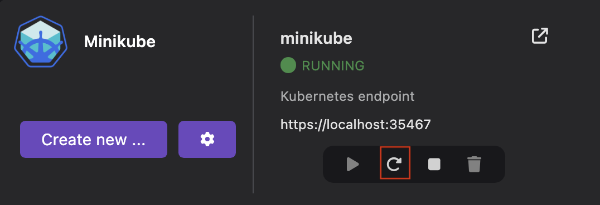
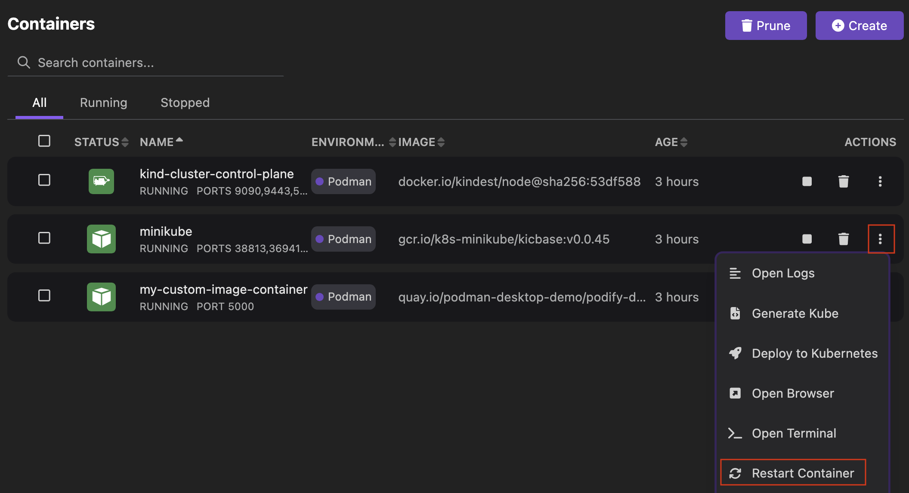

# Restarting your local Minikube-powered Kubernetes cluster

With Podman Desktop, you can restart your local Minikube-powered Kubernetes cluster.

#### Procedure

Perform one of the following steps:

- Restart using the **Settings** page

  1. Open **<Icon icon="fa-solid fa-cog" size="lg" /> Settings > Resources**.
  1. Find the Minikube cluster to restart.
  1. Click the **Restart** icon.
     

- Restart using the **Containers** page:
  1. Open **Containers** from the left navigation pane.
  1. Click the **overflow menu** icon corresponding to the Minikube cluster container and select **Restart Container**.
     

#### Verification

1. Open **Containers** from the left navigation pane.
1. Find the Minikube cluster that restarted. The cluster **Age** is consistent with the restart time.
1. Open **Pods** from the left navigation pane.
1. Find the pods that are running on your Minikube cluster.

#### Workaround

Minikube has no command to restart a cluster.
Therefore, Podman Desktop stops the Minikube cluster, and starts it again.
The Minikube cluster might not restart successfully.
In that case:

- Consider replacing Minikube with a local Kubernetes cluster that you can restart, such as [OpenShift Local](https://developers.redhat.com/products/openshift-local/).
- Consider [deleting your Minikube cluster](/docs/minikube/deleting-your-minikube-cluster), and [creating a Minikube cluster](/docs/minikube/creating-a-minikube-cluster).
