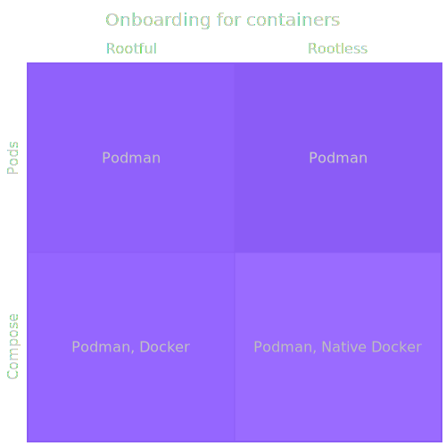

# Onboarding for container workloads

To run container workloads, set up at least one container engine.

Podman Desktop does not automatically set up container engine resources that you might not need.

#### Procedure

1. Select a container engine supporting your workload.

   | Workload            | Podman | Native Docker | Docker Desktop |
   | :------------------ | :----: | :-----------: | :------------: |
   | Rootless containers | ✅ yes |    ✅ yes     |     ❌ no      |
   | Rootful containers  | ✅ yes |    ✅ yes     |     ✅ yes     |
   | Compose             | ✅ yes |    ✅ yes     |     ✅ yes     |
   | Pods                | ✅ yes |     ❌ no     |     ❌ no      |

   Podman supports rootless container and pods, in addition to rootful containers and Compose.

2. Select an execution environment supporting your container engine and your operating system.

   - Select a Podman execution environment:

     | Host operating system | Native containers |        Podman machine         |  Lima instance  |
     | :-------------------- | :---------------: | :---------------------------: | :-------------: |
     | Windows               |       ❌ no       |            ✅ yes             | ❌ experimental |
     | macOS                 |       ❌ no       |            ✅ yes             |     ✅ yes      |
     | Linux                 |      ✅ yes       | ❌ disabled in Podman Desktop |     ✅ yes      |

   - Select a Docker execution environment:

     | Host operating system | Native containers | Lima instance | Docker Desktop |
     | :-------------------- | :---------------: | :-----------: | :------------: |
     | Windows               |       ❌ no       |     ❌ no     |     ✅ yes     |
     | macOS                 |       ❌ no       |    ✅ yes     |     ✅ yes     |
     | Linux                 |      ✅ yes       |     ❌ no     |     ✅ yes     |

3. Setup your container engine.

   - Podman Desktop assists you to set up Podman and Podman machines on Windows and macOS.

     - [Installing Podman on Windows](/docs/onboarding/containers/installing-podman-with-podman-desktop-on-windows).
     - [Installing Podman with OpenShift Local on Windows](/docs/onboarding/containers/installing-podman-with-openshift-local-on-windows).
     - [Creating a Podman machine with Podman Desktop](/docs/onboarding/containers/creating-a-podman-machine-with-podman-desktop).

   - Podman Desktop consumes your native containers, Lima instance or Docker setup.

     - [Creating a Lima instance](/docs/onboarding/containers/creating-a-lima-instance-with-podman-desktop).
     - [Installing Podman on Linux](https://podman.io/docs/installation#installing-on-linux).
