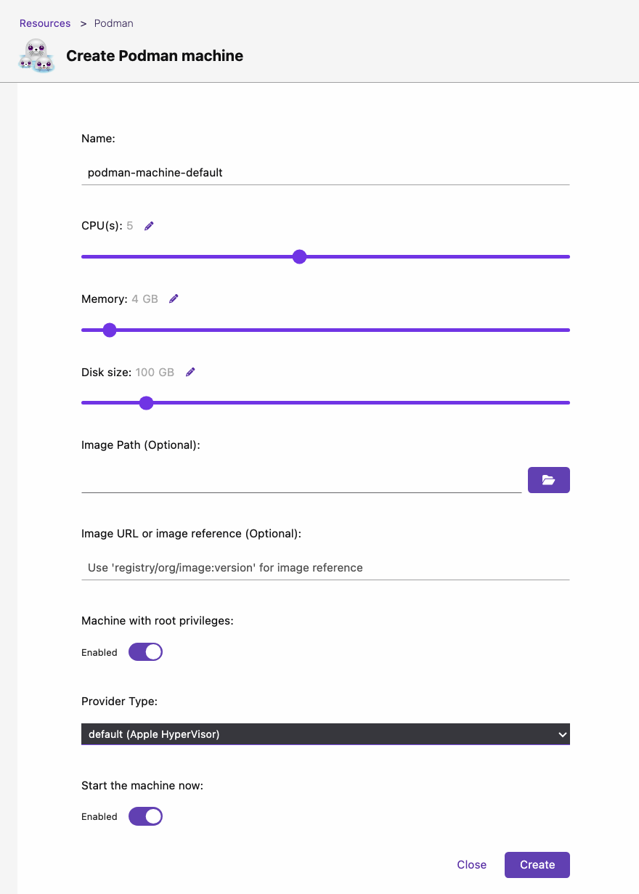

# Creating a Podman machine

On macOS and Windows, running the Podman container engine requires running a Linux virtual machine.

By default, Podman Desktop initializes a Podman machine with a standard configuration.

Consider creating a custom Podman machine to:

- Control the assigned resources: CPUs, memory, and disk size.
- Use a custom boot image.
- Use the rootful connection by default, for example to run Kind.
- (On Windows) Route the traffic through the network connection from your Windows session.

#### Prerequisites

- The Podman executable is installed.

#### Procedure

1. Go to **Settings > Resources**.
1. In the **Podman** tile, click **Create new**.
1. In the **Create a Podman machine** screen:

   1. **Name**:
      Enter a name, such as `podman-machine-default`.
   1. **CPU(s)**:
      Select the number of CPUs.
   1. **Memory**:
      Select the memory size.
   1. **Disk size**:
      Select the disk size.
   1. Optional: Provide a bootable image using one of the following options:
      - **Image Path**: Select an image, such as `podman-machine.aarch64.applehv.raw.zst` from your local machine.
      - **Image URL or image reference**: Enter an image URL or a registry path. You can use an image URL from the [Podman releases page](https://github.com/containers/podman/releases) or use a valid registry path in the format `registry/repo/image:version`.
   1. **Machine with root privileges**:
      Enable to use the rootful connection by default.
      Required to use Kind on Windows.
   1. Additional settings based on your operating system:   
         - (On Windows) **User mode networking (traffic relayed by a user process)**: Enable to route the traffic through the network connection from your Windows session. This setting is required to access resources behind your VPN connection.
         - (On macOS) **Provider Type**: The default value is `Apple HyperVisor`. Before switching to `GPU enabled (LibKrun)`, ensure that you have [configured the machine provider](/docs/installation/macos-install#using-libkrun-as-machine-provider) manually. 
   1. Click **Create**.

   
