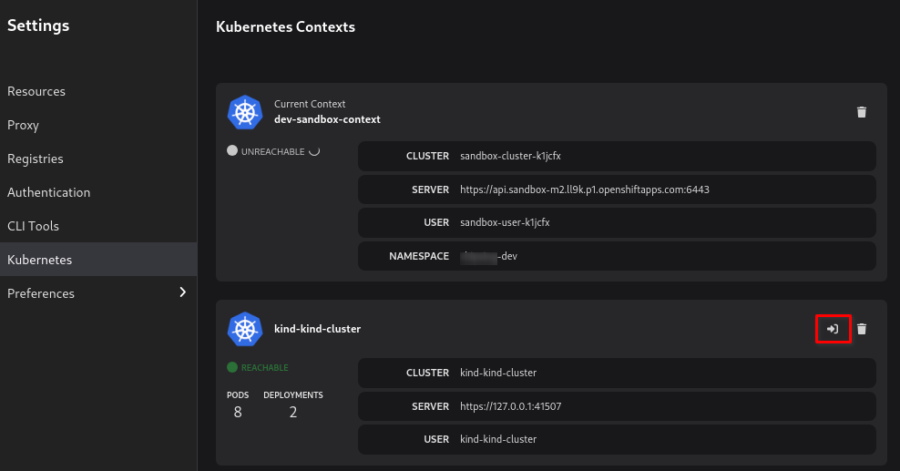
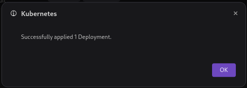

# Deploying a Kubernetes application

This tutorial covers the following end-to-end tasks you require to deploy an application in a Kubernetes cluster:

- Set the Kubernetes context
- Creating a deployment
- Creating a service

If you have multiple Kubernetes contexts, you must set the correct context in which you want to create your application resources. Within a Kubernetes cluster, you can access the application by its internal IP address. However, if you want to make your application accessible from an outside network, you must expose the pod containing your application as a Kubernetes service.

## Before you begin

- [Installed Podman Desktop application](/docs/installation)
- [A Podman machine](/docs/podman/creating-a-podman-machine)
- A running Kubernetes cluster
- A deployment YAML configuration for use. Create a `Deployment` file using the following code, if you do not have one on your machine:

```yaml
apiVersion: apps/v1
kind: Deployment
metadata:
  name: nginx-deployment
spec:
  replicas: 3
  selector:
    matchLabels:
      app: nginx
  template:
    metadata:
      labels:
        app: nginx
    spec:
      containers:
        - name: nginx-container
          image: nginx:latest
          ports:
            - containerPort: 80
```

This YAML configuration creates a deployment running three NGINX pods.

- A service YAML configuration for use. Create a `Service` file using the following code, if you do not have one on your machine:

```yaml
apiVersion: v1
kind: Service
metadata:
  name: my-service
spec:
  selector:
    app.kubernetes.io/name: MyApp
  ports:
    - protocol: TCP
      port: 80
      targetPort: 9376
```

This YAML configuration creates a new service named `my-service` with the default ClusterIP service type. The service listens for client requests on port `80` and then forwards those requests to port `9376` on the container.

## Setting the Kubernetes context

1. Go to **Settings > Kubernetes**.
2. Set the current Kubernetes context. For example, if you want to use a Kind cluster, use the **Set as Current Context** icon in the UI:
   

## Creating a deployment

1. Go to Kubernetes explorer from the left navigation pane.
2. Go to **Deployments** and Click **Apply YAML**.
   
3. Select the YAML configuration file and click **Open**. A successful operation notification opens.
   
4. Click **OK**.
5. View the newly created deployment on the same page.
   
6. Restart the Podman Desktop application.
7. Go to **Pods** from the left navigation pane.
8. View the three newly created `nginx-deplyment` pods.
   

## Creating a service

1. In the Kubernetes explorer, go to **Services**.
2. Click **Apply YAML**.
3. Select the YAML configuration file and click **Open**. A successful operation notification opens.
4. Click **OK**.
5. View the newly created service on the same page.
   
