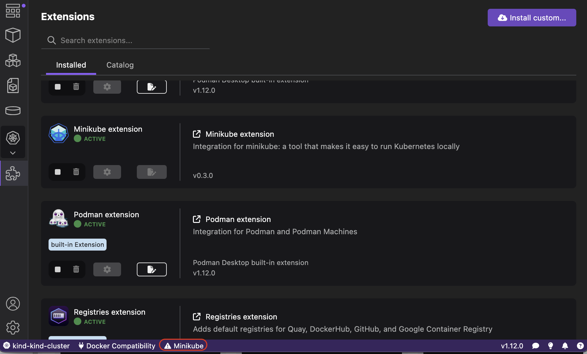

# Running a Kubernetes cluster

This tutorial covers the following end-to-end tasks required to run a Kubernetes cluster with the help of an extension:

- Installing the extension
- Installing CLI on your local machine
- Applicable on Windows: Configure Podman on WSL
- Creating and running a Kubernetes cluster

You can use extensions, such as Kind, MiniKube, and others to start a local Kubernetes development cluster. When you have a running Kubernetes cluster, you can easily develop and test Kubernetes applications before deploying them to production. This tutorial focuses on creating a Kubernetes cluster using the Minikube extension.

## Before you begin

- [Installed Podman Desktop application](/docs/installation)
- [A Podman machine](/docs/podman/creating-a-podman-machine)

## Installing the extension

1. Go to **extensions > Catalog**.
2. Click the **Install** icon to install the Minikube extension.
   

3. Select the **Installed** tab to check the Minikube extension is active.
   

## Installing CLI on your local machine

1. Click the **Minikube not found on your system** icon in the status bar.
   

2. Click **Yes** to download the Minikube binary.
3. Click **Yes** to install the binary system-wide for accessibility on the command line.
4. Enter your system password, if prompted. A notification of successful operation opens.
   

5. Click **OK**.
6. Check the **Minikube not found on your system** icon disappears from the status bar.

## Applicable on Windows: Configure Podman on WSL

A Podman machine runs in the rootless mode on a Windows Subsystem for Linux (WSL) instance. To use the Minikube tool, you must set the Podman machine to rootful mode.

- Run the following commands one by one:

  ```sh
  $ podman machine stop
  ```

  ```sh
  $ podman machine set --rootful
  ```

  ```sh
  $ podman machine start
  ```

## Creating and running a Kubernetes cluster

1. Go to **Settings > Resources**.
2. In the Minikube tile, click **Create new**.
   

3. Optional: Edit the cluster configuration, if required.
   
4. Click **Create**. A notification of successful operation opens.
5. Click **Go back to resources**.
6. View that your Minikube cluster is running and a new minikube context is added in the status bar.
   
