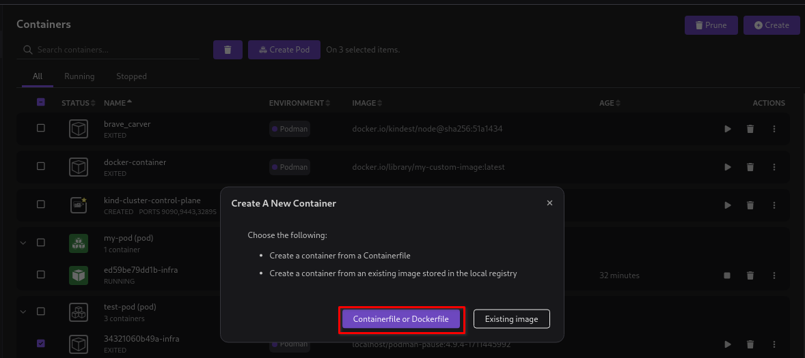
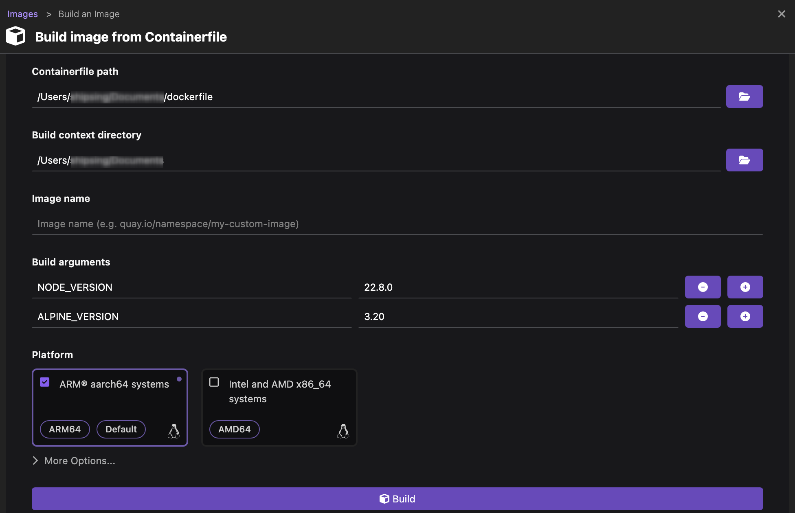
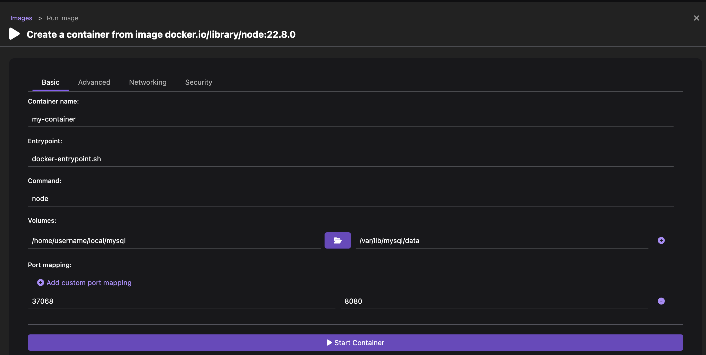
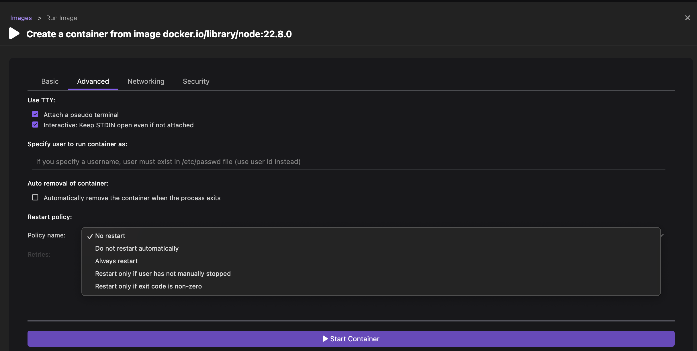
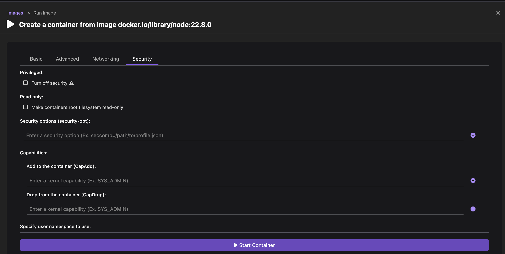
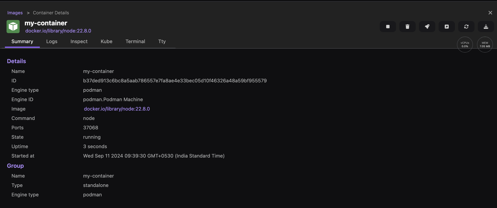
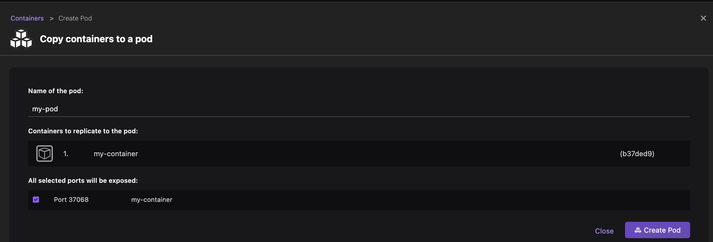

# Running a pod using a container or docker file

This tutorial covers the following end-to-end tasks a user requires to run a pod from a container or docker file:

- Building an image
- Creating a container
- Creating and running a pod

When creating a container, you can set the following configurations:

- With **Basic** configuration, you have the option to:

  - Define volumes to configure a persistent storage location. For this, you must set up a host directory and then mount this directory to a container. You can keep your application data intact in your host directory even after your container is stopped or failed.
  - Define port mapping to create an externally accessible container. For this, you must map a host port with the container port. After this mapping, any requests to port on the host are forwarded to port in the container.

  - Select a file containing environment variables for your container. This file contains data in the `key=value` format.

- With **Advanced** configuration, you have the option of:

  - Automatic removal of container
  - Specifying ID of the user who can run a container
  - Selecting a restart policy that defines whether a container should restart on exit

- With **Networking** configuration, you have the option of defining:

  - A container host name
  - A custom DNS server
  - Additional hosts
  - The networking mode for a container

- With **Security** configuration, you have the option to:
  - Secure you container resources
  - Make container root filesystem read-only
  - Add or drop security capabilities
  - Specify a namespace to restrict the usage of containers to a group of users with defined privileges and ownership

## Before you begin

- [Installed Podman Desktop application](/docs/installation)
- [A Podman machine](/docs/podman/creating-a-podman-machine)
- A docker or container file to use. Create a docker file using the following code, if you do not have one on your machine:

```dockerfile
# syntax=docker/dockerfile:1

ARG NODE_VERSION
ARG ALPINE_VERSION

FROM node:${NODE_VERSION}-alpine${ALPINE_VERSION} AS base
WORKDIR /src

FROM base AS build
COPY package*.json ./
RUN npm ci
RUN npm run build

FROM base AS production
COPY package*.json ./
RUN npm ci --omit=dev && npm cache clean --force
COPY --from=build /src/dist/ .
CMD ["node", "app.js"]
```

## Building an image

1. Click **Containers** in the left navigation pane.
2. Click **Create**.
   
3. On the **Build image from Containerfile** page, provide the following details:

   - Containerfile path: Select the path where the container or docker file is placed.
   - Build context directory: The field automatically picks up the context directory based on the file path.
   - Image name: Enter the image name, if required.
   - Build arguments: Pass the required arguments to build the image. This example uses arguments, such as `NODE_VERSION` and `ALPINE_VERSION`
   - Platform: Change the platform on which you want to build the image. The default platform is Intel and AMD x86_64 systems.
     

4. Click **Build**. The image starts to build.
5. Click **Done** once the image is built successfully.
6. View the newly created image on the **Images** page.

## Creating a container

1. Click **Images** in the left navigation pane.
2. Click the **Run Image** icon corresponding to the image you want to run. The **Create a container from image page** opens.
   

3. Optional: Configure the basic details of the container:
   
4. Optional: Select the **Advanced** tab to configure advanced details of the container:
   
5. Optional: Select the **Networking** tab to configure the networking details of the container:
   

6. Optional: Select the **Security** tab to configure the security details of the container:
   

7. Click **Start Container**.
8. Check the **Container Details** page for information, such as summary, logs, YAML code, and to access the terminal.
   

9. Click the close icon on the right hand side of the page.
10. View the newly created container on the **Containers** page

## Creating and running a pod

1. Go to **Containers** from the left navigation pane.
2. Select the containers from the container list.
   

3. Click **Create Pod**. The **Copy containers to a pod** page opens.
4. Change the name of the pod if required and click **Create Pod**.
   

5. View the newly created pod on the **Pods** page.
6. Click the **Start Pod** icon corresponding to the pod you created.
7. Check that the pod is running on the same page.
   
